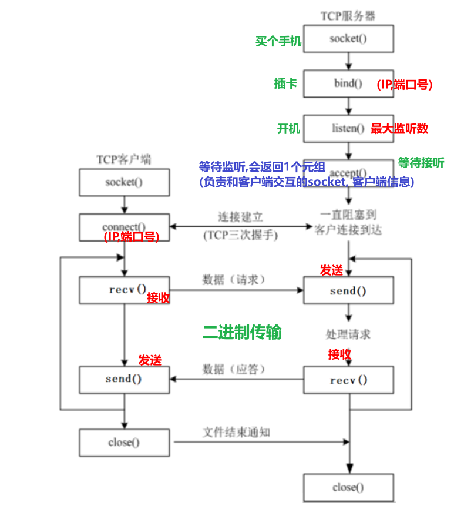
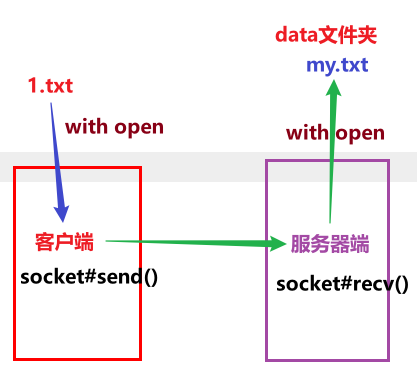
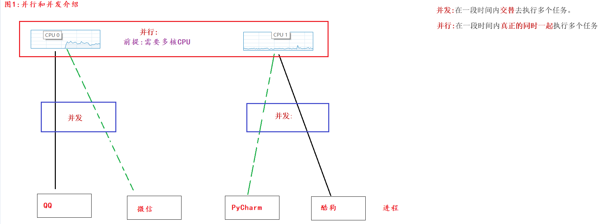
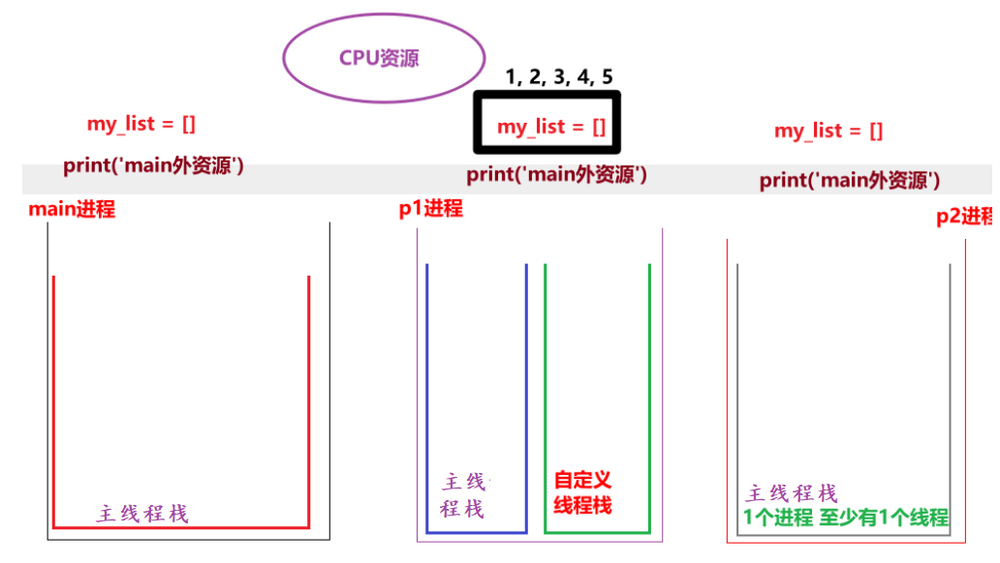

## 网络编程介绍

* 概述

  > 就是用来实现网络互联的 不同计算机上 运行的程序间  可以进行数据交互.

* 三要素

  * IP地址: 设备(电脑, 手机, Ipad...)在网络中的唯一标识

    > 分类:
    >
    > ​	IPV4, 4字节, 十进制. 例如: 192.168.88.100
    >
    > ​	IPV6, 8字节, 十六进制, 宣传语: 可以让地球上的每一粒沙子都有自己的IP
    >
    > 两个DOS命令:
    >
    > ​	查看IP: 
    >
    > ​		windows: ipconfig
    >
    > ​		Linux, Mac: ifconfig
    >
    > ​	测试网络连接:
    >
    > ​		ping ip地址 或者 域名

  * 端口号: 程序在设备(电脑, 手机, Ipad...)上的唯一标识.

    > 范围: 0 ~ 65535, 其中0 ~ 1023已经被系统占用或者用作保留端口, 自定义端口时尽量规避这个范围.

  * 协议: 传输规则, 规范.

    > 常用的协议:
    >
    > ​	TCP(这个用的最多) 和 UDP
    >
    > TCP特点:
    >
    > ​	1.面向有连接
    >
    > ​	2.采用字节流传输数据, 理论无大小限制.
    >
    > ​	3.安全(可靠)协议.
    >
    > ​	4.效率相对较低. 
    >
    > ​	5.区分客户端和服务器端.

## 入门创建Socket对象

```python
"""
案例: 演示socket对象的创建.

网络编程介绍:
    概述:
        网络编程也叫网络通信, Socket通信, 即: 通信双方都独有自己的Socket对象,
        数据在Socket之间通过 数据报包(UDP协议) 或者 字节流(TCP协议) 的形式进行传输.
    大白话举例:
        你和你遥远的朋友在聊天, 看看这你们两个人在交互, 其实是通过 两部手机(双方各自的手机)来交互的.
"""

# 导包
import socket

# 创建Socket对象
# 参1: Address Family, 地址族, 即: Ipv4 还是 IpV6, 默认值: AF_INET(ipv4)    AF_INET6(ipv6)
# 参2: Socket Type, Socket类型, 即: TCP 还是 UDP, 默认值: SOCK_STREAM(TCP)   SOCK_DGRAM(UDP)
socket_obj = socket.socket(socket.AF_INET, socket.SOCK_STREAM)
print(socket_obj)
```

## 网编案例_一句话交情

* 图解

  

* 服务器端代码

  ```python
  """
  案例: 网编入门案例, 服务器端给客户端发送消息, 客户端给出回执信息.
  
  服务器端开发流程:
      1.机器学习概述. 创建服务器端Socket对象.
      2. 绑定IP地址和端口号.
      3. 设置最大监听数.
      4. 等待客户端申请建立连接.
      5. 给客户端发送消息.
      6. 接收客户端的信息并打印.
      7. 释放资源.
  
  细节:
      客户端和服务器端是通过 字节流(bytes) 的形式实现的.
  """
  # 导包
  import socket
  
  # 1.机器学习概述. 创建服务器端Socket对象.  ipv4, 字节流(TCP)
  server_socket = socket.socket(socket.AF_INET, socket.SOCK_STREAM)
  # 2. 绑定IP地址和端口号.
  server_socket.bind(('192.168.22.51', 10086))
  # 3. 设置最大监听数.
  server_socket.listen(5)
  # 4. 等待客户端申请建立连接.
  accept_socket, client_info = server_socket.accept()
  # 5. 给客户端发送消息.
  accept_socket.send(b'Welcome To Socket!')
  # 6. 接收客户端的信息并打印.
  data = accept_socket.recv(1024).decode('utf-8')
  print(f'服务器端收到 来自{client_info} 的信息: {data}')
  # 7. 释放资源.
  accept_socket.close()
  # server_socket.close()     # 服务器端一般不关闭.
  ```

* 客户端代码

  ```python
  """
  案例: 网编入门案例, 服务器端给客户端发送消息, 客户端给出回执信息.
  
  客户端开发流程:
      1.机器学习概述. 创建客户端Socket对象.
      2. 连接服务器端, 指定: 服务器端IP, 端口号.
      3. 接收服务器端的信息并打印.
      4. 给服务器端发送消息.
      5. 释放资源.
  
  细节:
      客户端和服务器端是通过 字节流(bytes) 的形式实现的.
  """
  # 导包
  import socket
  
  # 1.机器学习概述. 创建客户端Socket对象. ipv4, TCP协议
  client_socket = socket.socket(socket.AF_INET, socket.SOCK_STREAM)
  # 2. 连接服务器端, 指定: 服务器端IP, 端口号.
  client_socket.connect(('192.168.22.51', 10086))
  # 3. 接收服务器端的信息并打印.
  data = client_socket.recv(1024).decode('utf-8')
  print(f'客户端收到: {data}')
  
  # 4. 给服务器端发送消息.
  client_socket.send('Socket很好玩儿, 很有趣, 我很喜欢!'.encode('utf-8'))
  # 5. 释放资源.
  client_socket.close()
  ```

## 网编案例_模拟多任务服务器端

```python
"""
案例: 网编入门案例, 服务器端给客户端发送消息, 客户端给出回执信息.

服务器端开发流程:
    1.机器学习概述. 创建服务器端Socket对象.
    2. 绑定IP地址和端口号.
    3. 设置最大监听数.
    4. 等待客户端申请建立连接.
    5. 给客户端发送消息.
    6. 接收客户端的信息并打印.
    7. 释放资源.

细节:
    客户端和服务器端是通过 字节流(bytes) 的形式实现的.
"""
# 导包
import socket

# 1.机器学习概述. 创建服务器端Socket对象.  ipv4, 字节流(TCP)
server_socket = socket.socket(socket.AF_INET, socket.SOCK_STREAM)
# 2. 绑定IP地址和端口号.
server_socket.bind(('192.168.22.51', 10086))
# 3. 设置最大监听数.
server_socket.listen(5)

while True:
    try:
        # 4. 等待客户端申请建立连接.
        accept_socket, client_info = server_socket.accept()

        # 5. 给客户端发送消息.
        accept_socket.send(b'Welcome To Socket!')

        # 6. 接收客户端的信息并打印.
        data = accept_socket.recv(1024).decode('utf-8')
        print(f'服务器端收到 来自{client_info} 的信息: {data}')
        # print(f'服务器端收到: {data}')

        # 7. 释放资源.
        accept_socket.close()
        # server_socket.close()     # 服务器端一般不关闭.
    except:
        pass


# 扩展: 设置端口号重用, 目的是: 快速重启服务器(服务器关闭后, 立即释放端口).
# 参1: 当前的套接字对象, 参2: 选项名, 参3: 该选项的值
# server_socket.setsockopt(socket.SOL_SOCKET, socket.SO_REUSEADDR, True)
```

## 扩展_编解码

```python
"""
案例: 演示编解码.

细节:
    1.机器学习概述. 编码 = 把我们看懂的 转成 我们看不懂的.
        '字符串'.encode(码表)
    2. 解码 = 把我们看不懂的 转成 我们看懂的.
        二进制.decode(码表)
    3. 只要乱码了, 原因只有1个, 编解码不同.
    4. 英文字母, 数字, 特殊符号无论什么码表都只占1个字节, 中文在gbk占2个字节, utf-8中占3个字节.
    5. 二进制数据特殊写法, 即: b'字母 数字 特俗符号',  该方式针对于中文无效.
"""

# 需求1: 编码.
# s1 = '黑马'
s1 = '黑马123abCD!@#'

print(s1.encode())          # b'\xe9\xbb\x91\xe9\xa9\xac123abCD!@#'
print(s1.encode('utf-8'))   # b'\xe9\xbb\x91\xe9\xa9\xac123abCD!@#'
print(s1.encode('gbk'))     # b'\xba\xda\xc2\xed123abCD!@#'
print('-' * 23)

# 需求2: 解码
bys = b'\xe9\xbb\x91\xe9\xa9\xac123abCD!@#'
print(type(bys))    # <class 'bytes'>

s2 = bys.decode()
s3 = bys.decode('utf-8')
print(s2)
print(s3)
print('-' * 23)

s4 = bys.decode('gbk')
print(s4)   # 榛戦┈123abCD!@#
```

## 网编案例_文件上传

* 图解

  

* 服务器端代码

  ```python
  """
  案例: 文件上传案例, 服务器端代码.
  
  回顾: 网编服务器端实现流程.
      1.机器学习概述. 创建服务器端Socket对象.
      2. 绑定ip 和 端口号.
      3. 设置最大监听数.
      4. 等待客户端申请建立连接
      5. 读取客户端上传的(文件)数据, 写到目的地文件
      6. 释放资源.
  """
  
  # 导包
  import socket
  
  # 1.机器学习概述. 创建服务器端Socket对象.
  server_socket = socket.socket(socket.AF_INET, socket.SOCK_STREAM)
  # 2. 绑定ip 和 端口号.
  server_socket.bind(("192.168.22.51", 6666))
  # 3. 设置最大监听数.
  server_socket.listen(5)
  # 4. 等待客户端申请建立连接
  accept_socket, client_info = server_socket.accept()
  
  # 5. 读取客户端上传的(文件)数据
  # 5.1.机器学习概述 关联目的地文件.
  with open('./data/my.txt', 'wb') as dest_f:
      # 5.2 循环读取数据
      while True:
          # 5.3 接收客户端上传的文件数据.
          bys = accept_socket.recv(8192)  # 8192字节 = 8kb
          # 5.4 判断是否读取到数据, 无数据(说明客户端断开连接)结束即可
          if len(bys) == 0:
              break
          # 5.5 把读取到的数据写入到目的地文件中.
          dest_f.write(bys)
  
  
  # 7. 释放资源.
  accept_socket.close()
  ```

* 客户端

  ```python
  """
  案例: 网编入门案例, 服务器端给客户端发送消息, 客户端给出回执信息.
  
  客户端开发流程:
      1.机器学习概述. 创建客户端Socket对象.
      2. 连接服务器端, 指定: 服务器端IP, 端口号.
      3. 接收服务器端的信息并打印.
      4. 给服务器端发送消息.
      5. 释放资源.
  
  细节:
      客户端和服务器端是通过 字节流(bytes) 的形式实现的.
  """
  # 导包
  import socket
  
  # 1.机器学习概述. 创建客户端Socket对象. ipv4, TCP协议
  client_socket = socket.socket(socket.AF_INET, socket.SOCK_STREAM)
  # 2. 连接服务器端, 指定: 服务器端IP, 端口号.
  client_socket.connect(('192.168.22.51', 10086))
  # 3. 接收服务器端的信息并打印.
  data = client_socket.recv(1024).decode('utf-8')
  print(f'客户端收到: {data}')
  
  # 4. 给服务器端发送消息.
  client_socket.send('Socket很好玩儿, 很有趣, 我很喜欢!'.encode('utf-8'))
  # 5. 释放资源.
  client_socket.close()
  ```

## 扩展_模拟多任务版文件上传服务器端

```python

```

## 多任务简介

* 概述

  > 让多个任务"同时"执行, 目的是: 充分利用CPU资源, 提高程序的执行效率.

* 方式

  * 并发: 针对于单核CPU来讲, 多个任务同时请求执行时, CPU做高效切换即可.
  * 并行:针对于多核CPU来讲, 多个任务同时执行.

* 图解

  


## 单任务代码演示

```python
"""
案例: 演示单任务, 前边不执行完毕, 后边绝对无法执行.
"""

# 1.机器学习概述.定义函数A, 输出10次 hello world
def func_a():
    for i in range(1000000):
        print("hello world")

# 2. 定义函数B, 输出10次 hello python
def func_b():
    for i in range(2):
        print("hello python")


func_a()
print('-' * 23)
func_b()

```

## 多进程入门案例

* 入门案例

  ```python
  """
  案例: 演示多进程入门案例.
  
  多进程目的:
      它属于多任务的一种实现方式, 目的是充分利用CPU资源, 提高程序执行效率.
  
  实现方式:
      1.机器学习概述. 导包.
      2. 创建进程对象, 关联目标函数.
      3. 启动进程.
  """
  
  # 导包
  import multiprocessing
  import time
  
  # 1.机器学习概述. 定义函数 表示 编写代码.
  def coding():
      for i in range(1, 11):
          time.sleep(0.1) # 可以模拟耗时操作, 更好的查看多任务的执行效果.
          print(f'正在敲第 {i} 遍代码!')
  
  
  # 2. 定义函数 表示 听音乐。
  def music():
      for i in range(1, 11):
          time.sleep(0.1)
          print(f'正在听第 {i} 遍音乐......')
  
  
  # 3. 创建两个进程对象, 分别关联上述的两个 目标函数.
  # 细节: 通过main进程(主进程)来创建子进程.
  if __name__ == '__main__':
      # 单任务
      # coding()
      # music()
      # 进程p1关联 coding函数, p1进程抢到(CPU资源了), 就会执行这个函数.
      p1 = multiprocessing.Process(target=coding)
      p2 = multiprocessing.Process(target=music)
  
      # 4. 启动进程. 大白话: 表示进程启动了, 就可以开始抢CPU资源了.
      p1.start()
      p2.start()
  ```

* 带参数的多进程代码

  ```python
  """
  案例: 演示带参数的多进程.
  
  进程传参有两种方式:
      方式1: args方式, 接受所有的 位置参数.
      方式2: kwargs方式, 接受所有的 关键字参数.
  """
  # 导包
  import multiprocessing, time
  
  # 需求: 小明一边敲代码, 一边听音乐.
  # 1.机器学习概述. 定义函数, 表示敲代码.
  def coding(name, num):
      for i in range(1, num + 1):
          time.sleep(0.1)
          print(f'{name} 正在敲第 {i} 行代码...')
  
  # 2. 定义函数, 表示听音乐.
  def music(name, count):
      for i in range(1, count + 1):
          time.sleep(0.1)
          print(f'{name} 正在听第 {i} 首歌...........')
  
  # 3.创建主进程(主线程)
  if __name__ == '__main__':
      # 4. 创建两个子进程, 分别关联上述的目标函数.
      p1 = multiprocessing.Process(target=coding, args=('虚竹', 10))
      p2 = multiprocessing.Process(target=music, kwargs={'count': 20, 'name': '刘备'})
  
      # 5. 开启子进程.
      p1.start()
      p2.start()
  ```

## 获取进程编号

```python
"""
案例: 演示获取进程的编号.

进程的编号解释:
    概述:
        在设备中, 每个程序(进程)都有自己的唯一进程id, 当程序释放的时候, 该进程id也会释放. 即: 进程id是可以重复使用的.
    目的:
        1.机器学习概述. 查看子进程和父进程的关系, 方便 管理.
        2. 例如: 杀死指定进程, 创建子进程...
    格式:
        查看当前进程的pid:
            os模块(operating, 系统模块) 的 getpid()        get Process id
            multiprocessing#current_process()的pid属性

        查看当前进程的ppid:        parent process id(父进程id)
            os#getppid()
细节:
    main中创建的进程, 如果没有特殊指定, 它的父进程都是main进程,
    而main进程的父进程是 PyCharm程序的pid
"""

# 导包
import multiprocessing, time
import os


# 需求: 小明一边敲代码, 一边听音乐.
# 1.机器学习概述. 定义函数, 表示敲代码.
def coding(name, num):
    for i in range(1, num + 1):
        time.sleep(0.1)
        print(f'{name} 正在敲第 {i} 行代码...')
    print(f'p1进程的pid: {os.getpid()}, {multiprocessing.current_process().pid}, 父进程id(ppid为) : {os.getppid()}')


# 2. 定义函数, 表示听音乐.
def music(name, count):
    for i in range(1, count + 1):
        time.sleep(0.1)
        print(f'{name} 正在听第 {i} 首歌...........')
    print(f'p2进程的pid: {os.getpid()}, {multiprocessing.current_process().pid}, 父进程id(ppid为) : {os.getppid()}')


# 3.创建主进程(主线程)
if __name__ == '__main__':
    # 4. 创建两个子进程, 分别关联上述的目标函数.
    p1 = multiprocessing.Process(target=coding, args=('虚竹', 10))
    p2 = multiprocessing.Process(target=music, kwargs={'count': 20, 'name': '刘备'})

    # 5. 开启子进程.
    p1.start()
    p2.start()

    # 6. 查看主进程的信息.
    print(f'main进程的pid: {os.getpid()}, {multiprocessing.current_process().pid}, 父进程id(ppid为) : {os.getppid()}')
```

## 进程特点_数据隔离

* 图解

  

* 代码

  ```python
  """
  案例: 演示进程的特点.
  
  进程的特点:
      1.机器学习概述. 进程之间数据是相互隔离的.
          因为子进程相当于是父进程的"副本", 会将父进程的"main外资源"拷贝一份, 即: 各是各的.
      2. 默认情况下, 主进程会等待子进程执行结束再结束.
  """
  import multiprocessing
  import time
  
  # 需求: 定义1个公共的容器 my_list = [], 一个进程往里边写数据, 另一个进程从里边读数据, 看是否能读取到.
  
  # 1.机器学习概述. 定义1个公共的容器 my_list = []
  my_list = []
  
  # 2. 定义函数, 往容器中添加数据.
  def write_data():
      for i in range(1, 6):
          my_list.append(i)
          print(f'添加数据: {i}')
  
      # 走到这里, 说明添加完毕, 打印即可.
      print(f'write_data函数: {my_list}')   # [1.机器学习概述, 2, 3, 4, 5]
  
  
  # 3. 定义函数, 从容器中读取数据.
  def read_data():
      time.sleep(3)
      print(f'read_data函数: {my_list}')   # []
  
  
  print('我是main外资源, 看我执行了几次')
  
  # 4. 测试
  if __name__ == '__main__':
      # 5. 创建两个子进程, 分别关联上述的两个函数.
      p1 = multiprocessing.Process(target=write_data)
      p2 = multiprocessing.Process(target=read_data)
  
      # 6. 启动进程.
      p1.start()
      p2.start()
      # print('我是main内资源, 看我执行了几次')
  ```

## 进程特点_守护进程

```python
"""
案例: 演示进程特点之 默认情况下, 主进程会等待子进程执行结束再结束.

进程的特点:
    1.机器学习概述. 进程之间数据是相互隔离的.
        因为子进程相当于是父进程的"副本", 会将父进程的"main外资源"拷贝一份, 即: 各是各的.
    2. 默认情况下, 主进程会等待子进程执行结束再结束.
       如果要设置主进程结束, 子进程同步结束, 方式如下:
        思路1: 设置子进程为 守护进程.
        思路2: 强制关闭子进程.   可能会导致子进程变成僵尸进程, 交由Python 解释器自动回收(底层有 init初始化进程来管理维护).

"""
import multiprocessing
import time


# 导包


# 1.机器学习概述.定义函数, 表示: 子进程的目标函数.
def work():
    for i in range(10):
        print('正在努力工作中...')
        time.sleep(0.2)


# 2.测试
if __name__ == '__main__':
    # 3. 创建子进程, 关联目标函数.
    # 细节: 进程的默认命名规则是: Process-编号, 编号是从1开始的.
    # p1 = multiprocessing.Process(target=work, name='刘亦菲')
    # print(f'p1进程的名字: {p1.name}')

    p1 = multiprocessing.Process(target=work)
    # 思路1: 设置p1为: 守护进程.
    p1.daemon = True    # 设置p1为: 守护进程.

    # 4.启动进程.
    p1.start()

    # 5.主进程(main)休眠1秒后, 结束.
    time.sleep(1)

    # 思路2: 强制关闭子进程.
    # p1.terminate()
    print('main进程结束了.')
```

## 线程入门

* 无参数

  ```python
  """
  案例: 线程入门案例, 一边听音乐, 一边写代码.
  
  
  线程的使用步骤:
      1. 导包
      2. 创建线程对象.
      3. 启动线程.
  
  
  线程和进程的关系:
      1. 进程是CPU分配资源的基本单位, 线程是CPU调度资源的最小单位.
      2. 线程是依附于进程的, 每个进程至少有1个线程(主线程栈)
      3. 进程间数据相互隔离, (同一个进程的)线程间数据可以共享.
  """
  
  # 导包
  import threading, time
  
  # 1. 定义函数, 表示: 敲代码.
  def coding():
      for i in range(1, 11):
          time.sleep(0.1)
          print(f'正在敲第 {i} 遍代码...')
  
  
  # 2. 定义函数, 表示: 听音乐.
  def music():
      for i in range(1, 11):
          time.sleep(0.1)
          print(f'正在听第 {i} 首音乐...')
  
  # 3. 测试
  if __name__ == '__main__':
      # 4. 创建两个线程对象, 分别关联上述的两个目标函数.
      t1 = threading.Thread(target=coding)
      t2 = threading.Thread(target=music)
  
  
      # 5. 启动线程.
      t1.start()
      t2.start()
  
  ```

* 带参数

  ```python
  """
  案例: 线程入门案例, 一边听音乐, 一边写代码.
  
  
  线程的使用步骤:
      1.机器学习概述. 导包
      2. 创建线程对象.
      3. 启动线程.
  
  
  线程和进程的关系:
      1.机器学习概述. 进程是CPU分配资源的基本单位, 线程是CPU调度资源的最小单位.
      2. 线程是依附于进程的, 每个进程至少有1个线程(主线程栈)
      3. 进程间数据相互隔离, (同一个进程的)线程间数据可以共享.
  """
  
  # 导包
  import threading, time
  
  # 1.机器学习概述. 定义函数, 表示: 敲代码.
  def coding(name, num):
      for i in range(1, num + 1):
          time.sleep(0.1)
          print(f' {name} 正在敲第 {i} 遍代码...')
  
  
  # 2. 定义函数, 表示: 听音乐.
  def music(name, count):
      for i in range(1, count + 1):
          time.sleep(0.1)
          print(f' {name} 正在听第 {i} 首音乐*********')
  
  # 3. 测试
  if __name__ == '__main__':
      # 4. 创建两个线程对象, 分别关联上述的两个目标函数.
      t1 = threading.Thread(target=coding, args=('李想', 100))
      t2 = threading.Thread(target=music, kwargs={'count':50, 'name':'周力'})
  
      # 5. 启动线程.
      t1.start()
      t2.start()
  ```
