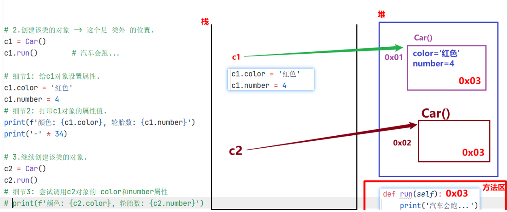
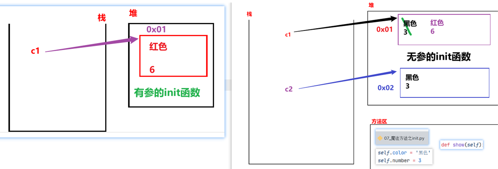

## 面向对象和面向过程

* 编程思想

  > 就是人们利用计算机来解决问题的思维.

* 分类

  * 面向过程

    > 它是一种编程思想, 强调的是以 步骤(过程) 为基础完成各种操作.

  * 面向对象

    > **参考思路:** 概述, 思想特点, 举例, 总结
    >
    > 它是一种编程思想, 强调的是以 **对象** 为基础完成各种操作, 它是基于 面向过程的. 
    > 说到面向对象, 不得不提的就是它的三大思想特点:
    >
    >  	1. 更符合人们的思考习惯.
    >  	2.  把复杂的事情简单化.
    >  	3. 把人们(程序员)从执行者变成指挥者.
    >
    > 举例: 越符合当时的场景越好, 例如: 买电脑, 洗衣服...
    >
    > 总结: 万物接对象.

## 面向对象特征介绍

* 三大特征

  * 封装
  * 继承
  * 多态

* 封装简介

  * 概述

    > 就是隐藏对象的属性和实现细节, 仅对外提供公共的访问方式. 

  * 举例

    * 电脑, 手机, 函数, 类 = 属性 + 行为

  * 好处

    > 提高代码的安全性.     (私有化)
    >
    > 提高代码的复用性.      (函数)

* 继承

  * 概述

    > 子类继承父类的成员, 例如: 属性, 行为等.  
    > 大白话: 子承父业. 

  * 好处

    > 提高代码的复用性. 

* 多态

  * 概述

    > 大白话： 同一个事物在不同时刻表现出来的不同状态, 形态.
    >
    > 专业版： 同1个函数， 接收不同的对象， 有不同的效果。 

## 入门案例_汽车类

```python
"""
案例: 演示定义汽车类 及  使用类中的成员.

面向对象核心概念:
    类: 抽象的概念, 看不见, 摸不着, 是 属性(名词) 和 行为(动词)的集合.
    对象: 类的具体体现, 实现.
    属性(名词): 用来描述事物的外在特征的, 例如: 姓名, 年龄...
        格式: 和以前定义变量一样.
    行为(动词): 用来描述事物能够做什么的, 例如: 吃, 喝...
        格式: 和以前定义函数一样.

定义类的格式:
    class 类名:
        # 属性
        # 行为

如何访问类中的成员?
    step1: 创建该类的对象.
        对象名 = 类名()
    step2: 通过 对象名. 的方式调用.
        对象性.属性名
        对象名.行为名()

需求: 定义汽车类, 有跑的行为.
"""


# 1.定义汽车类.
class Car:      # 类名遵循 大驼峰命名法.
    # 属性

    # 行为
    def run(self):
        print('汽车会跑!...')


# 2.创建汽车类的对象.
c1 = Car()

# 3. 调用Car类的run()函数, 简写版: 调用Car#run()
c1.run()
```

## self关键字介绍

* 案例1

  ```python
  """
  案例: self关键字介绍.
  
  self介绍:
      概述:
          它是Python内置的关键字, 用于表示 本类当前对象的引用.
      作用:
          1个类是可以有多个对象的, 这多个对象都可以通过 对象名. 的方式访问类中的行为(函数)
          函数默认有self属性, 函数通过self来区分到底是哪个对象调用的该函数.
      大白话:
          谁调用函数, self就代表哪个对象.
  """
  
  # 需求: 定义汽车类, 创建多个该类的对象, 看看打印结果.
  # 1. 定义汽车类.
  class Car:
      # 属性
  
      # 行为, 跑
      def run(self):
          print('汽车会跑!...')
          print(f'我是run函数, self的值是: {self}')
  
  
  # 2.创建汽车类的对象.
  c1 = Car()
  print(f'c1对象: {c1}')
  # 通过 对象名. 的形式, 调用Car#run()
  c1.run()
  print('-' * 34)
  
  # 3.继续创建汽车类的对象.
  c2 = Car()
  print(f'c2对象: {c2}')
  # 通过 对象名. 的形式, 调用Car#run()
  c2.run()
  ```

* 案例2

  ```python
  """
  案例: 演示通过 self关键字实现 在类内访问其它函数.'
  
  self关键字:
      概述:
          代表本类当前对象的引用, 谁(哪个对象)调用, self就代表谁.
      作用:
          用于实现函数 区分 不同对象的.
  
  总结:
      1.在 类外 访问类中的行为, 需要通过 对象名. 的方式访问.
      2.在 类内 访问类中的行为，需要通过 self. 的方式访问。
  """
  
  # 需求: 定义汽车类, 类内有run()函数, 并在work()中调用run()函数, 创建该类对象, 调用上述的函数.
  
  # 1. 定义汽车类.
  class Car:
      # 属性(名词)
  
      # 行为(动词)
      # 1.1 run()函数
      def run(self):
          print(f'{self} 汽车在跑...')
  
      # 1.2 work()函数, 在其内部调用run()
      def work(self):
          print(f'我是work函数, 我的self值: {self}')
          self.run()      # self = 本类当前对象的引用.
  
  
  # 2.在类外访问Car类的行为(函数)
  c1 = Car()
  print(f'c1对象: {c1}')
  c1.run()        # c1在跑
  print('-' * 34)
  c1.work()       # c1在work, c1在跑
  print('=' * 34) # 分割线
  
  
  # 3.再次创建对象.
  c2 = Car()
  print(f'c2对象: {c2}')
  c2.run()
  print('-' * 34)
  c2.work()
  ```

## 入门案例_手机类

```python
"""
案例: 定义手机类, 能开机, 关机, 拍照.

回顾:
    定义类的格式
        class 类名:
            # 属性
            # 行为

    访问 类中成员 的格式:
        类外: 对象名. 的方式
        类内: self. 的方式
"""

# 1.定义手机类.
class Phone:
    # 属性

    # 行为
    # 1.1 开机.
    def open(self):
        print(f'{self} 手机开机了')

    # 1.2 关机.
    def close(self):
        print(f'{self} 手机关机了')

    # 1.3 拍照.
    def take_photo(self):
        print(f'{self} 手机拍照了')


# 2. 创建手机类对象, 访问其成员.
p1 = Phone()
print(f'p1对象: {p1}')
p1.open()
p1.take_photo()
p1.close()
print('-' * 34)

# 3.继续创建手机类对象, 访问其成员.
p2 = Phone()
print(f'p2对象: {p2}')
p2.open()
p2.take_photo()
p2.close()
```

## 类外_获取和设置对象的属性



```python
"""
案例: 演示在类外 如何获取 和 设置 对象的属性.

类外, 设置对象的属性, 格式如下:
    对象名.属性名 = 属性值
    特点: 该属性独属于这个对象, 即: 该类的其它对象没有这个属性.

类外, 获取对象的属性, 格式如下:
    对象名.属性名
"""

# 需求: 创建汽车类, 设置为红色, 4个轮胎, 有跑的功能.
# 1.创建汽车类.
class Car:
    # 属性(名词), 事物具有哪些特征 -> 变量.


    # 行为(动词), 事物能够做什么 -> 函数.
    def run(self):
        print('汽车会跑...')

    # pass


# 2.创建该类的对象 -> 这个是 类外 的位置.
c1 = Car()
c1.run()        # 汽车会跑...

# 细节1: 给c1对象设置属性.
c1.color = '红色'
c1.number = 4
# 细节2: 打印c1对象的属性值.
print(f'颜色: {c1.color}, 轮胎数: {c1.number}')
print('-' * 34)

# 3.继续创建该类的对象.
c2 = Car()
c2.run()
# 细节3: 尝试调用c2对象的 color和number属性
# print(f'颜色: {c2.color}, 轮胎数: {c2.number}')
```

## 类内_获取对象的属性

```python
"""
案例: 演示类内如何获取对象的属性.

回顾(总结):
    1. 类外访问类中的成员, 可以通过 对象名. 的方式.
    2. 类内访问类中的成员, 可以通过 self. 的方式.
    3. 类外通过 对象名.属性名 = 属性值 的方式 设置属性, 只有当前对象有.

细节:
    类内如何设置属性, 要结合 魔法方法 __init__() 来实现, 稍后讲.
"""

# 1. 定义汽车类, 创建该类对象, 赋予颜色 和 轮胎数两个属性, 并在类内访问该属性.
class Car:
    # 属性


    # 行为
    # 1.1 跑
    def run(self):
        print('汽车会跑')

    # 1.2 定义函数show(), 实现 在类内访问 汽车对象的属性.
    def show(self):
        print(f'我是show函数, 对象的颜色: {self.color}, 轮胎数: {self.number}')


# 2.创建汽车类的对象
c1 = Car()

# 3. 给其(c1)赋予 属性 -> 类外设置属性.
c1.color = '红色'
c1.number = 4

# 4. 类外访问属性.
print(f"颜色: {c1.color}, 轮胎数: {c1.number}")

# 5. 类外访问行为(类中的函数)
c1.run()
c1.show()
print('-' * 34)

# 6. 继续创建汽车类对象, 尝试分别调用run(), show()函数.
c2 = Car()
c2.run()
# c2.show()       # 报错.
```

## 魔法方法之init方法

* 图解

  

* 案例1: 无参数版

  ```python
  """
  案例: 演示 init魔法方法的 用法.
  
  
  魔法方法:
      概述/特点:
          Python内置的函数, 在满足特定的场景下, 会被 自动调用.
      常用的魔法方法:
          __init__()      在(每次)创建对象的时候, 会自动触发该类的 __init__()函数.
          __str__()
          __del__()
  """
  
  # 需求: 定义汽车类, 默认属性为: color='黑色', number=3
  # 1. 定义汽车类.
  class Car:
      # 1.1 在魔法方法 init()中, 初始化: 属性.
      def __init__(self):
          print('我是 无参 init 魔法方法')
  
          # 1.2 在init魔法方法中, 初始化属性, 则: 该类所有的对象, 一创建, 就有这些属性了.
          self.color = '黑色'
          self.number = 3
  
      # 1.3 定义show()函数, 打印该类对象的 各个属性值.
      def show(self):
          print(f'颜色: {self.color}, 轮胎数: {self.number}')
  
  
  
  # 2.创建汽车类对象.
  c1 = Car()      # 会自动调用 __init__()函数.
  # 修改c1的属性值
  c1.color = '红色'
  c1.number = 6
  # 打印c1对象的属性值.
  print(c1.color, c1.number)
  c1.show()
  
  print('-' * 34)
  c2 = Car()
  c2.show()
  ```

* 案例2: 有参数版

  ```python
  """
  案例: 演示魔法方法之 init 有参版, 实际开发常用.
  
  回顾:
      __init__()魔法方法, 在创建对象的时候, 会被自动调用, 一般用于给该类对象 的属性进行初始化.
  
  大白话举例:
      无参版 init ->  默认上的有底色, 你需要重新涂色(覆盖底色)
      有参版 init ->  默认没有涂色的石膏娃娃, 我们根据喜好自由涂色即可.
  """
  
  # 需求: 创建汽车类, 不给默认值, 由汽车对象 外部各自赋值即可.
  # 1. 定义汽车类.
  class Car:
      # 2.有参的 __init__()函数, 参数值由: 外部对象自行赋值.
      def __init__(self, color, number):
          """
          该魔法方法用于给 汽车类 对象的属性 赋值.
          :param color:  车的颜色
          :param number: 车的轮胎数
          """
          self.color = color
          self.number = number
  
      # 定义show()函数, 打印该类对象的 各个属性值.
      def show(self):
          print(f'颜色: {self.color}, 轮胎数: {self.number}')
  
  # 3. 创建汽车类对象.
  # c1 = Car()  # 报错, 因为默认调用了init()函数, 但是该函数有参数, 则必须传参.
  c1 = Car('红色', 6)
  c1.show()
  print('-' * 23)
  
  c2 = Car('绿色', 4)
  c2.show()
  
  c3 = Car()
  ```

## 魔法方法之str方法

```python
"""
案例: 演示 str魔法方法的 用法.


魔法方法:
    概述/特点:
        Python内置的函数, 在满足特定的场景下, 会被 自动调用.
    常用的魔法方法:
        __init__()      在(每次)创建对象的时候, 会自动触发该类的 __init__()函数.
        __str__()       当用print()函数 打印对象的时候, 会自动调用该对象(所在类)的 str魔法方法.
                        该魔法方法默认打印的是对象的地址值, 无意义, 一般都会重写, 改为打印 对象的各个属性值.
        __del__()
"""
# 1. 定义汽车类.
class Car:
    # 2.有参的 __init__()函数, 参数值由: 外部对象自行赋值.
    def __init__(self, color, number):
        """
        该魔法方法用于给 汽车类 对象的属性 赋值.
        :param color:  车的颜色
        :param number: 车的轮胎数
        """
        self.color = color
        self.number = number


    # 魔法方法str(), 默认打印地址值, 无意义, 一般会重写, 改为打印对象的各个属性值.
    def __str__(self):
        return f'颜色: {self.color}, 轮胎数: {self.number}'
        # return f'{self.color}, {self.number}'


# 3.创建该类的对象.
c1 = Car('绿色', 4)
print(c1)       # 输出语句打印对象, 默认调用了该对象 所在类的 str魔法方法.
print('-' * 23)

c2 = Car('红色', 6)
print(c2)
```

## 魔法方法之del方法

```python
"""
案例: 演示 str魔法方法的 用法.


魔法方法:
    概述/特点:
        Python内置的函数, 在满足特定的场景下, 会被 自动调用.
    常用的魔法方法:
        __init__()      在(每次)创建对象的时候, 会自动触发该类的 __init__()函数.
        __str__()       当用print()函数 打印对象的时候, 会自动调用该对象(所在类)的 str魔法方法.
                        该魔法方法默认打印的是对象的地址值, 无意义, 一般都会重写, 改为打印 对象的各个属性值.
        __del__()       当.py文件执行结束, 或者 手动 del 释放对象资源, 会自动调用该函数.
"""

# 1. 定义汽车类, 属性: 品牌.   行为:run()   通过del魔法方法删除该类的对象, 看看效果.
class Car:
    # 2. 在魔法方法init中, 完成: 属性的初始化.
    def __init__(self, brand):
        self.brand = brand

    # 3.重写 str魔法方法, 打印对象的属性值.
    def __str__(self):
        return f'品牌: {self.brand}'

    # 4. 重写 del魔法方法, 删除对象时给出提示.
    def __del__(self):
        print(f'{self} 对象被删除了!')


# 5. 创建汽车类对象.
c1 = Car('小米 Su7 Ultra')
print(c1)

# 6. 手动访问 brand 属性.
print(c1.brand)
print('-' * 23)

# 7.手动删除c1对象, 然后尝试 打印该对象 或者 访问对象的属性.
# del c1
# print(c1)       # 报错.

print('程序结束!')
```

## 减肥案例

```python
"""
案例: 减肥案例.

需求:
    例如，小明同学当前体重是100kg。每当他跑步一次时，则会减少0.5kg；每当他大吃大喝一次时，则会增加2kg。请试着采用面向对象方式完成案例。

分析:
    类名:         Student
    对象名:        xm
    属性(名词):   当前体重, current_weight
    行为(动词)    跑步, 吃饭
"""
# 1.定义学生类.
class Student:
    # 2.在魔法方法init中, 完成: 对象的属性的初始化.
    def __init__(self):
        self.current_weight = 100

    # 3.每当他跑步一次时，则会减少0.5kg
    def run(self):
        print('疯狂跑步...')
        self.current_weight -= 0.5      # 体重减小.

    # 4.大吃大喝.
    def eat(self):
        print('大吃大喝一顿...')
        self.current_weight += 2

    # 5.重写魔法方法str, 打印属性值, 即: 当前体重.
    def __str__(self):
        # return '当前体重: %s' % self.current_weight
        return f'当前体重: {self.current_weight} kg!'

# 6. 测试.
if __name__ == '__main__':
    # 6.1 创建学生对象.
    xm = Student()

    # 6.2 跑步
    xm.run()
    xm.run()

    # 6.3 吃喝
    xm.eat()

    # 6.4 当前体重.
    print(xm)
```

## 烤地瓜案例


```python
"""
案例: 烤地瓜案例.

需求:
    1. 定义地瓜类 -> SweetPotato
    2. 属性: 被烤时间cook_time, 烘焙状态 cook_state, 调料 condiments
    3. 行为: 烘烤cook(), 添加调料 add_condiment()
    4. 魔法方法: init() -> 初始化属性,  str() -> 打印地瓜信息.
    5. 规则:
        烘烤时间        地瓜状态
        [0, 3)          生的          包左不包右, 前闭后开.
        [3, 7)          半生不熟
        [7, 12)         熟了
        [12, ∞]         糊了
"""
# 1. 定义地瓜类 -> SweetPotato
class SweetPotato:
    # 2. 在魔法方法__init__()中, 初始化地瓜的属性.
    def __init__(self):
        self.cook_time = 0
        self.cook_state = '生的'
        self.condiments = []

    # 3.具体的烘烤动作.
    def cook(self, time):
        # 3.1 根据烘烤时间, 修改地瓜的烘烤状态.
        if time < 0:
            print('无效值!')
        else:
            # 3.2 修改地瓜的 烘烤时间.
            self.cook_time += time
            # 3.3 根据烘烤时间, 修改地瓜的烘烤状态.
            if 0 <= self.cook_time < 3:
                self.cook_state = '生的'
            elif 3 <= self.cook_time < 7:
                self.cook_state = '半生不熟'
            elif 7 <= self.cook_time < 12:
                self.cook_state = '熟了'
            else:
                self.cook_state = '糊了'

    # 4. 添加调料 add_condiment()
    def add_condiment(self, condiment):
        self.condiments.append(condiment)

    # 5. 重写str()方法, 打印地瓜信息.
    def __str__(self):
        return f'烘烤时间: {self.cook_time}, 地瓜状态: {self.cook_state}, 调料: {self.condiments}'

# 6.测试.
if __name__ == '__main__':
    # 7. 创建地瓜对象
    dg = SweetPotato()

    # 8. 具体的烘烤动作.
    # dg.cook(-3)
    dg.cook(3)
    dg.cook(5)
    dg.cook(7)

    # 9. 添加调料
    dg.add_condiment('芥末/辣根')
    dg.add_condiment('折耳根')
    dg.add_condiment('豆汁')
    dg.add_condiment('鲱鱼罐头')

    # 10. 打印地瓜状态.
    print(dg)
```

## 创建类的格式

```python
"""
案例: 创建类的格式介绍.


格式1:
    class 类名:
        pass

格式2:
    class 类名():
        pass

格式3:
    # class 类名(父类名):
    class 类名(object):
        pass
"""

# 需求: 定义老师类
# class Teacher:
# class Teacher():
class Teacher(object):  # object是所有类的父类, Python中所有的类都直接或者间接继承自object类.
    pass


t1 = Teacher()
print(t1)
```

## 继承入门

```python
"""
案例: 继承入门.


继承介绍:
    概述:
        大白话: 子承父业.
        专业版: 子类可以继承父类的属性 和 行为.
    写法:
        class 子类名(父类名):
            pass
    例如:
        class A(B):
            pass
    叫法:
        A: 子类, 派生类
        B: 父类, 基类, 超类
    好处:
        提高代码的复用性
    弊端:
        耦合性增强了, 父类不好的内容, 子类想没有都不行.
    扩展: 开发原则
        高内聚, 低耦合.
        内聚: 指的是类自己独立处理问题的能力.
        耦合: 指的是类与类之间的关系.
        大白话解释: 自己能搞定的事儿, 就不要麻烦别人.
"""

# 需求: 定义父类(男, 散步), 定义子类, 继承父类.
# 1. 定义父类.
class Father(object):
    def __init__(self):
        self.gender = '男'

    def walk(self):
        print('饭后走一走, 活到九十九!')

    # def smoking(self):
    #     print('抽烟有害, 健康!')

# 2. 定义子类.
class Son(Father):
    pass


# 3.测试子类的功能.
s = Son()
print(f'性别: {s.gender}')    # 子类从父类继承过来 属性.
s.walk()                     # 子类从父类继承过来 行为.
# s.smoking()
```

## 单继承演示

```python
"""
案例: 演示单继承, 即: 1个子类继承自 1个父类.

故事1: 一个摊煎饼的老师傅，在煎饼果子界摸爬滚打多年，研发了一套精湛的摊煎饼技术， 师父要把这套技术传授给他的唯一的最得意的徒弟。

分析:
    1. 定义师傅类, Master
        属性: kongfu
        行为: make_cake()
    2. 定义子类, Prentice, 继承师傅类.
"""

# 1. 定义师傅类.
class Master:
    # 1.1 定义属性.
    def __init__(self):
        self.kongfu = '[古法配方]'

    # 1.2 定义行为.
    def make_cake(self):
        print(f'采用 {self.kongfu} 摊煎饼果子.')


# 2.定义徒弟类, 继承自师傅类.
class Prentice(Master):
    pass

# 3.测试.
p = Prentice()
p.make_cake()
```

## 多继承演示

```python
"""
案例: 演示多继承.

需求: 小明是个爱学习的好孩子，想学习更多的摊煎饼果子技术，于是，在百度搜索到黑马程序员学校，报班来培训学习摊煎饼果子技术。

扩展: MRO机制.
    解释:
        Python中有MRO机制, 可以查看某个对象, 在调用函数时的 顺序, 即: 先找哪个类, 后找哪个类.
    格式:
        类名.mro()
        类名.__mro__

"""
# 1. 定义师傅类.
class Master:
    # 1.1 定义师傅类属性.
    def __init__(self):
        self.kongfu = '[古法煎饼果子配方]'

    # 1.2 定义师傅类方法.
    def make_cake(self):
        print(f'运用 {self.kongfu} 制作煎饼果子')

# 2. 定义黑马学校类.
class School:
    # 2.1 定义学校类属性.
    def __init__(self):
        self.kongfu = '[黑马AI煎饼果子配方]'

    # 2.2 定义学校类方法.
    def make_cake(self):
        print(f'运用 {self.kongfu} 制作煎饼果子')


# 3.定义徒弟类 -> 有个对象叫 小明.
class Prentice(School, Master): # 从左往右, 就近原则.
    pass


# 4.测试.
xm = Prentice()
print(xm.kongfu)        #
xm.make_cake()
print('-' * 23)

# 5. 查看mro机制的结果.
print(Prentice.mro())       # Prentice -> School -> Master -> object
print(Prentice.__mro__)     # Prentice -> School -> Master -> object
```


