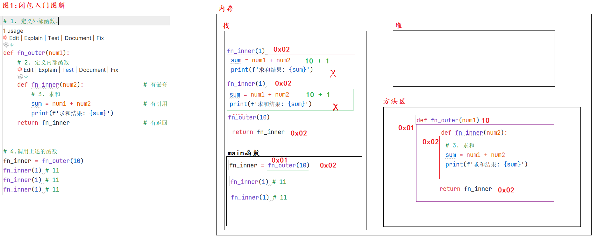
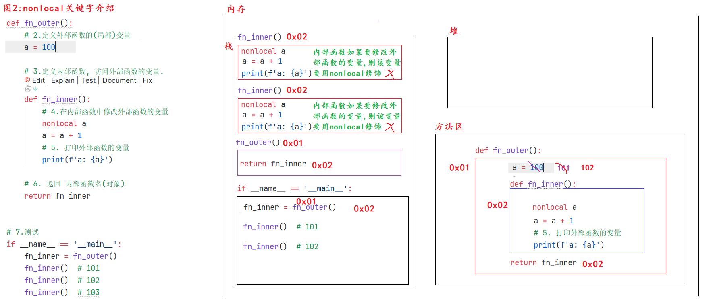
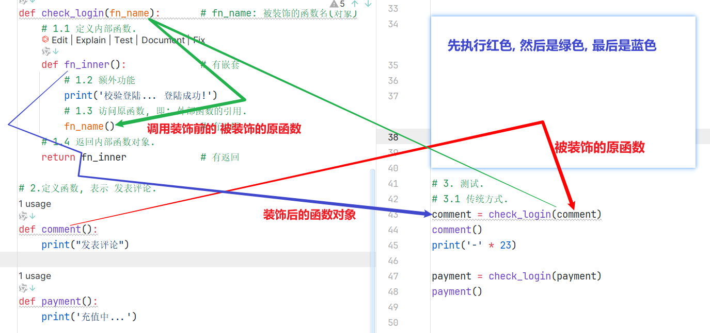
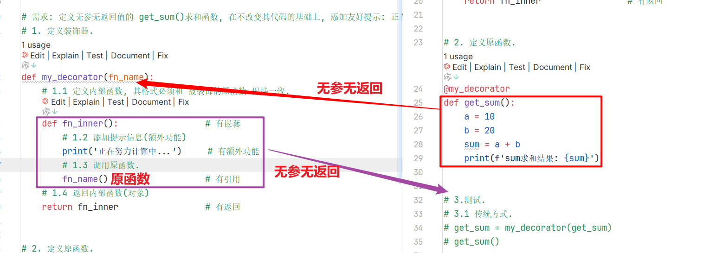

## 闭包背景介绍

```python
"""
案例: 闭包背景介绍

案例目的:
    引出来 闭包 相关的知识点.
"""

# 需求: 定义函数保存变量10, 调用函数返回值 并 重复累加数值, 观察结果.
# 1. 定义函数, 保存变量10
def func():
    num = 10
    return num


# 2. 调用函数, 获取返回值.
num = func()
print(num + 1)  # 11
print(num + 1)  # 11
print(num + 1)  # 11
```

## 闭包入门



```python
"""
案例: 闭包入门.

闭包解释:
    概述:
        内部函数 使用了外部函数的变量, 这种写法就称之为闭包.
    格式:
        def 外部函数名(形参列表):
            外部函数的(局部)变量

            def 内部函数名(形参列表):
                使用外部函数的变量

            return 内部函数名
    前提条件:
        1. 有嵌套.         外部函数嵌套内部函数
        2. 有引用.         内部函数使用外部函数的变量
        3. 有返回.         外部函数中, 返回 内部函数名(对象)

细节:
    1. 函数名 和 函数名() 是两个概念, 前者表示 函数对象, 后者表示 调用函数, 获取返回值.
"""

# 案例1: 函数名 -> 是对象
def get_sum(a, b):
    return a + b

print(get_sum)  # <function get_sum at 0x000001B4AC3DD800>, 对象.
print(get_sum(10, 20))      # 调用函数, 获取返回值.

# 函数名可以赋值给变量, 这个变量就是: 函数对象.
my_sum = get_sum
print(my_sum)   # <function get_sum at 0x00000251CE53D800>
print(my_sum(100, 200))     # 300
print('-' * 23)


# 案例2: 演示闭包写法.
# 需求: 定义求和的闭包, 外部函数有参数num1, 内部函数有参数num2, 调用, 求解两数之和, 观察结果.

# 1. 定义外部函数.
def fn_outer(num1):
    # 2. 定义内部函数
    def fn_inner(num2):                 # 有嵌套
        # 3. 求和
        sum = num1 + num2               # 有引用
        print(f'求和结果: {sum}')
    return fn_inner                     # 有返回


# 4.调用上述的函数
fn_inner = fn_outer(10)
fn_inner(20)
print('-' * 23)

fn_outer(100)(200)
```

## nonlocal关键字介绍

* 图解

  

* 代码

  ```python
  """
  案例: nonlocal关键字介绍
  
  nonlocal:
      它是Python内置的关键字, 可以实现 在内部函数中 修改外部函数的 变量值.
  """
  
  # 需求: 编写1个闭包,让内部函数访问外部函数的参数 a = 100, 并观察结果.
  # 1. 定义外部函数.
  def fn_outer():
      # 2.定义外部函数的(局部)变量
      a = 100
  
      # 3.定义内部函数, 访问外部函数的变量.
      def fn_inner():
          # 4.在内部函数中修改外部函数的变量
          nonlocal a      # nonlocal: 可以实现在内部函数中修改外部函数的变量值.
          a = a + 1
          # 5. 打印外部函数的变量
          print(f'a: {a}')
  
      # 6. 返回 内部函数名(对象)
      return fn_inner
  
  
  # 7.测试
  if __name__ == '__main__':
      fn_inner = fn_outer()
      fn_inner()  # 101
      fn_inner()  # 102
      fn_inner()  # 103
  ```

## 装饰器入门

* 图解

  

* 代码

  ```python
  """
  案例: 装饰器入门.
  
  装饰器介绍:
      概述/作用:
          它的本质是1个闭包函数, 目的是 在不改变原有函数的基础上, 对其功能做增强.
          大白话: 装修队 在不改变房屋结构的情况下, 对房屋做装饰(功能增强)
      前提条件:
          1. 有嵌套.
          2. 有引用.
          3. 有返回.
          4. 有额外功能.
      装饰器的用法:
          格式1: 传统写法.
              装饰后的函数名 = 装饰器名(被装饰的原函数名)
              装饰后的函数名()
  
          格式2: 语法糖.
              在要被装饰的原函数上, 直接写 @装饰器名, 之后直接调用原函数即可.
  """
  # 需求: 在发表评论前, 都是需要先登录的.
  
  # 1.定义外部函数, 形参列表接收 要被装饰的函数名(对象)
  def check_login(fn_name):       # fn_name: 被装饰的函数名(对象)
      # 1.1 定义内部函数.
      def fn_inner():             # 有嵌套
          # 1.2 额外功能
          print('校验登陆... 登陆成功!')
          # 1.3 访问原函数, 即: 外部函数的引用.
          fn_name()               # 有引用
      # 1.4 返回内部函数对象.
      return fn_inner             # 有返回
  
  # 2.定义函数, 表示 发表评论.
  def comment():
      print("发表评论")
  
  @check_login    # 底层其实是: payment = check_login(payment)
  def payment():
      print('充值中...')
  
  # 3. 测试.
  # 3.1 传统方式.
  comment = check_login(comment)
  comment()
  print('-' * 23)
  
  # 3.2 语法糖
  # payment = check_login(payment)
  # payment()
  payment()
  
  ```

## 装饰器案例

* 场景1: ==**无参无返回值的原函数**==

  

  ```python
  """
  案例: 装饰器装饰_无参无返回的原函数
  
  细节:
      装饰器的内部函数格式 要和 被装饰的原函数 保持一致,
      即: 原函数是无参无返回的, 则 装饰器的内部函数也必须是 无参无返回的.
          原函数有参有返回的, 则 装饰器的内部函数也必须是 有参有返回的.
  """
  
  # 需求: 定义无参无返回值的 get_sum()求和函数, 在不改变其代码的基础上, 添加友好提示: 正在努力计算中...
  # 1. 定义装饰器.
  def my_decorator(fn_name):
      # 1.1 定义内部函数, 其格式必须和 被装饰的原函数 保持一致.
      def fn_inner():                 # 有嵌套
          # 1.2 添加提示信息(额外功能)
          print('正在努力计算中...')     # 有额外功能
          # 1.3 调用原函数.
          fn_name()                   # 有引用
      # 1.4 返回内部函数(对象)
      return fn_inner                 # 有返回
  
  
  # 2. 定义原函数.
  @my_decorator
  def get_sum():
      a = 10
      b = 20
      sum = a + b
      print(f'sum求和结果: {sum}')
  
  
  # 3.测试.
  # 3.1 传统方式.
  # get_sum = my_decorator(get_sum)
  # get_sum()
  
  # 3.2 语法糖.
  get_sum()
  ```

* 场景2: ==**有参无返回值的原函数**==

  ```python
  """
  案例: 装饰器装饰_有参无返回的原函数
  
  细节:
      装饰器的内部函数格式 要和 被装饰的原函数 保持一致,
      即: 原函数是无参无返回的, 则 装饰器的内部函数也必须是 无参无返回的.
          原函数有参有返回的, 则 装饰器的内部函数也必须是 有参有返回的.
  """
  
  # 需求: 定义有参无返回值的 get_sum()求和函数, 在不改变其代码的基础上, 添加友好提示: 正在努力计算中...
  # 1. 定义装饰器.
  def my_decorator(fn_name):
      # 1.1 定义内部函数
      def fn_inner(x, y):
          # 1.2 额外功能
          print('正在努力计算中...')
          # 1.3 调用原函数.
          fn_name(x, y)
      # 1.4 返回内部函数.
      return fn_inner
  
  # 2. 定义原函数, 有参无返回值.
  @my_decorator
  def get_sum(a, b):
      sum = a + b
      print(f'sum求和结果: {sum}')
  
  
  # 3.测试.
  # 3.1 传统方式.
  # get_sum = my_decorator(get_sum)
  # get_sum(10, 20)
  
  # 3.2 语法糖.
  get_sum(10, 20)
  ```
