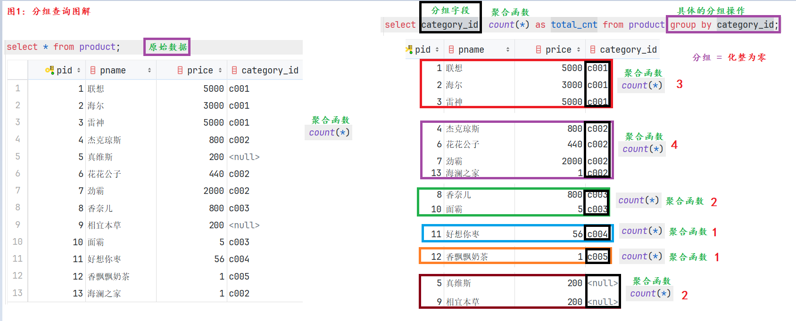
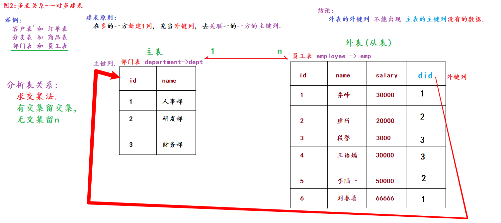
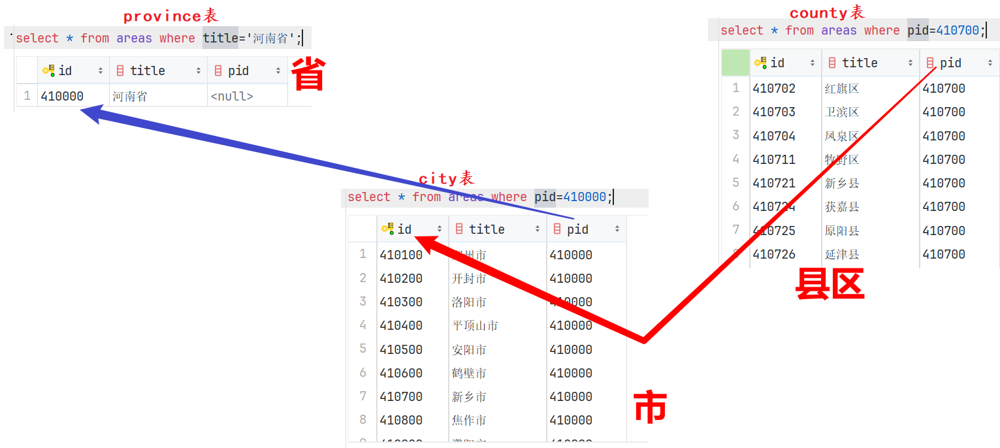

## 单表约束_介绍

```sql
# --------------------- 案例1: 演示单表约束 ---------------------
/*
约束介绍:
    概述:
        约束可以理解为在数据类型的基础上, 继续都某列数据值 做限定, 例如: 不能重复, 不能为空等...
        专业版: 约束是用来保证数据的完整性 和 安全性的.
    分类:
        单表约束:
            主键约束: primary key
                特点: 非空, 唯一, 一般结合 auto_increment(自动增长) 一起使用.
            非空约束: not null
                特点: 该列值不能为空, 但是可以: 重复.
            唯一约束: unique
                特点: 该列值不能重复, 但是可以: 为空.
            默认约束: default 默认值
                特点: 如果添加数据的时候没有给值, 就用默认值填充. 类似于Python中的 缺省参数(默认参数)
        多表约束:
            主外键约束: foreign key
*/
-- 1. 创建数据库.
drop database day02;
create database day02 charset 'utf8';
-- 2. 切库.
use day02;
-- 3. 查看数据表.
show tables;
-- 4. 创建数据表, 用于演示单表约束.
create table if not exists stu(
    id int primary key auto_increment,  # id列, 主键列(非空,唯一), 自增
    name varchar(10) not null,          # 姓名, 不能为空
    phone varchar(11) unique,           # 手机号, 唯一
    gender varchar(2),                  # 性别, 没有限定.
    address varchar(10) default '北京'   # 默认约束
);
# 5. 往表中添加数据, 用于测试: 约束.
# 正常添加结果
insert into stu values(null, '杨过', '111', '男', '上海');
insert into stu values(null, '郭靖', '222', '男', '广州');
insert into stu values(null, '黄蓉', '333', '女', '深圳');
# 测试 默认约束
insert into stu(id, name, phone, gender) values(null, '尹志平', '444', '男');
# 测试 非空约束.
insert into stu values(null, null, '555', '女', '深圳');   # 报错, Column 'name' cannot be null
# 测试 唯一约束
insert into stu values(null, '黄蓉', '555', '女', '深圳');
insert into stu values(null, '黄蓉', null, '女', '深圳');
insert into stu values(null, '黄蓉', '555', '女', '深圳');   # 报错, Duplicate entry '555' for key 'phone'
# 6. 查看表数据.
select * from stu;
# 7. 查看表结构
desc stu;
```

## 单表查询_简单查询

```sql
# --------------------- 案例2: 演示单表查询 -> 简单查询 ---------------------
/*
单表查询, 完整查询格式如下:
    select
        [distinct] 列名1 as 别名, 列名2 as 别名, ...
    from
        数据表名
    where
        组前筛选
    group by
        分组字段
    having
        组后筛选
    order by
        排序字段 [asc | desc]
    limit
        起始索引, 数据条数;
*/
# 1. 创建商品表.
create table product
(
    pid         int primary key auto_increment, # 商品id, 主键
    pname       varchar(20),    # 商品名
    price       double,         # 商品单价
    category_id varchar(32)     # 商品的分类id
);

# 2. 添加表数据.
INSERT INTO product(pid,pname,price,category_id) VALUES(null,'联想',5000,'c001');
INSERT INTO product(pid,pname,price,category_id) VALUES(null,'海尔',3000,'c001');
INSERT INTO product(pid,pname,price,category_id) VALUES(null,'雷神',5000,'c001');
INSERT INTO product(pid,pname,price,category_id) VALUES(null,'杰克琼斯',800,'c002');
INSERT INTO product(pid,pname,price,category_id) VALUES(null,'真维斯',200, null);
INSERT INTO product(pid,pname,price,category_id) VALUES(null,'花花公子',440,'c002');
INSERT INTO product(pid,pname,price,category_id) VALUES(null,'劲霸',2000,'c002');
INSERT INTO product(pid,pname,price,category_id) VALUES(null,'香奈儿',800,'c003');
INSERT INTO product(pid,pname,price,category_id) VALUES(null,'相宜本草',200, null);
INSERT INTO product(pid,pname,price,category_id) VALUES(null,'面霸',5,'c003');
INSERT INTO product(pid,pname,price,category_id) VALUES(null,'好想你枣',56,'c004');
INSERT INTO product(pid,pname,price,category_id) VALUES(null,'香飘飘奶茶',1,'c005');
INSERT INTO product(pid,pname,price,category_id) VALUES(null,'海澜之家',1,'c002');

# 3. 查看表数据.
# 需求1: 查询所有的商品信息
select * from product;
select pid, pname, price, category_id from product; # 效果同上.

# 需求2: 查看商品名 和 商品价格.
select pname, price from product;
# 扩展: 起别名, 列名, 表名都可以起别名.
# 格式: 列名 as 别名  或者 表名 as 别名, 其中 as 可以省略不写.
select pname as 商品名, price 商品价格 from product as p;

# 需求3: 查看结果是表达式, 将所有的商品价格+10, 进行展示.
select pname, price + 10 from product;
select pname, price + 10 as price from product;
```

## 条件查询_比较运算符

```sql
# --------------------- 案例3: 演示单表查询 -> 条件查询 ---------------------
# 格式: select 列名1, 列名2... from 数据表名 where 条件;
# 场景1: 比较运算符, >, >=, <, <=, =, !=, <>
# 需求1: 查询商品名称为“花花公子”的商品所有信息：
select * from product where pname ='花花公子';
# 需求2: 查询价格为800商品
select * from product where price=800;
# 需求3: 查询价格不是800的所有商品
select * from product where price!=800;
select * from product where price<>800;
# 需求4: 查询商品价格大于60元的所有商品信息
select * from product where price > 60;
# 需求5: 查询商品价格小于等于800元的所有商品信息
select * from product where price <= 800;
```

## 条件查询_逻辑运算符和范围查询

```sql
# 场景2: 范围查询.   between 值1 and 值2  -> 适用于连续的区间,   in (值1, 值2..)  -> 适用于 固定值的判断.
# 场景3: 逻辑运算符. and, or, not
# 需求6: 查询商品价格在200到800之间所有商品
select * from product where price between 200 and 800;  # 包左包右.
select * from product where price >= 200 and price <= 800;

# 需求7: 查询商品价格是200或800的所有商品
select * from product where price in (200, 800);
select * from product where price=200 or price=800;

# 需求8: 查询价格不是800的所有商品
select * from product where price != 800;
select * from product where not price = 800;
select * from product where price not in (800);
```

## 条件判断_模糊查询和非空判断

```sql
# 场景4: 模糊查询. 字段名 like '_内容%'     _ 代表任意的1个字符; %代表任意的多个字符, 至少0个, 至多无所谓.
# 需求9: 查询以'香'开头的所有商品
select * from product where pname like '香%';
# 需求10: 查询第二个字为'想'的所有商品
select * from product where pname like '_想%';
select * from product where pname like '_想';    # 只能查出 *想 两个字的, 不符合题设.

# 场景5: 非空查询.   is null,  is not null,   不能用=来判断空.
# 需求11: 查询没有分类的商品
select * from product where category_id=null;       # 不报错,但是没结果.
select * from product where category_id is null;    # 正确的, 判空操作.

# 需求12: 查询有分类的商品
select * from product where category_id is not null;   # 正确的, 非空判断操作.
```

## 排序查询

```sql
# --------------------- 案例4: 演示单表查询 -> 排序查询 ---------------------
# 格式: select * from 表名 order by 排序的字段1 [asc | desc], 排序的字段2 [asc | desc], ...;
# 解释1: ascending: 升序,  descending: 降序.
# 解释2: 默认是升序, 所以asc可以省略不写.
# 需求1: 根据价格降序排列.
select * from product order by price;       # 默认是: 升序.
select * from product order by price asc;   # 效果同上.
select * from product order by price desc;  # 价格降序排列.

# 需求2: 根据价格降序排列, 价格一样的情况下, 根据分类降序排列.
select * from product order by price desc, category_id desc;
```

## 聚合查询

```sql
# --------------------- 案例5: 演示单表查询 -> 聚合查询 ---------------------
/*
聚合查询(多进一出)介绍:
    概述:
        聚合查询是对表中的某列数据做操作.
    常用的聚合函数:
        count()     统计某列值的个数, 只统计非空值. 一般用于统计 表中数据的总条数.
        sum()       求和
        max()       求最大值
        min()       求最小值
        avg()       求平均值
面试题: count(*), count(1), count(列)的区别是什么?
    区别1: 是否统计空值
        count(列): 只统计该列的非空值.
        count(1), count(*): 统计所有数据, 包括空值.
    区别2: 效率问题.
        count(主键列) > count(1) > count(*) > count(普通列)
*/
# 需求1: 查询商品的总条数
select count(pid) as total_cnt from product;
select count(category_id) as total_cnt from product;
select count(*) as total_cnt from product;
select count(1) as total_cnt from product;

# 需求2: 查询价格大于200商品的总条数
select count(pid) as total_cnt from product where price > 200;

# 需求3: 查询分类为'c001'的所有商品价格的总和
select sum(price) as total_price from product where category_id='c001';

# 需求4: 查询分类为'c002'所有商品的平均价格
select avg(price) as avg_price from product where category_id='c002';

# 需求5: 查询商品的最大价格和最小价格     扩展: ctrl + alt + 字母L 代码格式化.
select
    max(price) as max_price,
    min(price) as min_price
from
    product;
```

## 分组查询



```sql
# --------------------- 案例6: 演示单表查询 -> 分组查询 ---------------------
/*
分组查询介绍:
    概述:
        简单理解为, 根据分组字段, 把表数据 化整为零, 然后基于每个分组后的每个部分, 进行对应的聚合运算.
    格式:
        select 列1, 列2... from 数据表名 where 组前筛选 group by 分组字段 having 组后筛选;
    细节:
        1. 分组查询 一般要结合 聚合函数一起使用, 且根据谁分组, 就根据谁查询.
        2. 组前筛选用where, 组后筛选用having.
        3. 面试题: where 和 having的区别是什么?
            where: 组前筛选, 后边不能跟聚合函数.
            having: 组后筛选, 后边可以跟聚合函数.
        4. 分组查询的查询列 只能出现 分组字段, 聚合函数.
        5. 如果只分组, 没有写聚合, 可以理解为是: 基于分组字段, 进行去重查询
 */
# 需求1: 统计各个分类商品的个数.
select category_id, count(*) as total_cnt from product group by category_id;

# 需求2: 统计各个分类商品的个数, 且只显示个数大于1的信息.
select
    category_id,
    count(*) as total_cnt
from
    product
group by
    category_id     # 根据商品类别分组.
having
    total_cnt > 1;  # 组后筛选

# 需求3: 演示  如果只分组, 没有写聚合, 可以理解为是: 基于分组字段, 进行去重查询
select category_id from product group by category_id;
select category_id from product group by category_id;

# 还可以通过 distinct 关键字来实现去重.
select distinct category_id from product;

# 此时是: 按照category_id 和 price作为整体, 然后去重.
select distinct category_id, price from product;
select category_id, price from product group by category_id, price;  # 效果同上.
```

## 分页查询

```sql
# --------------------- 案例7: 演示单表查询 -> 分页查询 ---------------------
/*
分页查询介绍:
    概述:
        分页查询 = 每次从数据表中查询出固定条数的数据, 一方面可以降低服务器的压力, 另一方面可以降低浏览器端的压力, 且可以提高用户体验.
        实际开发中非常常用.
    格式:
        limit 起始索引, 数据条数;
    细节:
        1. 表中每条数据都有自己的索引, 且索引是从0开始的.
        2. 如果是从索引0开始获取数据的, 则索引0可以省略不写.
    要学好分页, 掌握如下的几个参数计算规则即可:
        数据总条数:      count() 函数
        每页的数据条数:   产品经理, 项目经理, 你...
        每页的起始索引:   (当前的页数 - 1) * 每页的数据条数
        总页数:          (数据总条数 + 每页的数据条数 - 1) // 每页的数据条数
                        (13 + 5 - 1) // 5 = 17 // 5 = 3页
                        (14 + 5 - 1) // 5 = 18 // 5 = 3页
                        (15 + 5 - 1) // 5 = 19 // 5 = 3页
                        (16 + 5 - 1) // 5 = 20 // 5 = 4页
*/
# 需求1: 5条/页.
select * from product limit 5;      # 第1页, 从索引0开始, 获取5条.
select * from product limit 0, 5;   # 第1页, 从索引0开始, 获取5条, 效果同上.

select * from product limit 0, 5;   # 第1页, 从索引0开始, 获取5条.
select * from product limit 5, 5;   # 第2页, 从索引5开始, 获取5条.

# 需求2: 3条/页
select * from product limit 0, 3;  # 第1页, 从索引0开始, 获取3条.
select * from product limit 3, 3;  # 第2页, 从索引3开始, 获取3条.
select * from product limit 6, 3;  # 第3页, 从索引6开始, 获取3条.
select * from product limit 9, 3;  # 第4页, 从索引9开始, 获取3条.
select * from product limit 12, 3;  # 第5页, 从索引12开始, 获取3条.

# 总结, 回顾单表查询的格式
/*
select
    [distinct] 列1 as 别名, 列2
from
    数据表名
where
    组前筛选
group by
    分组字段
having
    组后筛选
order by
    排序字段 [asc | desc]
limit
    起始索引, 数据条数;
*/
# 需求: 统计商品表中, 每类商品的单价总和, 只统计单价在100以上的商品, 只查看单价总和在500以上的分类, 按照商品总价降序排列, 只获取商品总价高的前2条数信息.
select
    category_id,
    sum(price) total_price
from
    product
where               # 组前筛选
    price > 100
group by            # 分组
    category_id
having              # 组后筛选
    total_price > 500
order by            # 排序
    total_price desc
limit 0, 2;         # 分页
```

## 多表建表_一对多

* 图解

  

* 代码

  ```sql
  # ---------------------- 案例1: 多表建表 一对多关系 ----------------------
  /*
  多表关系解释:
      概述:
          MySQL是一种关系型数据库, 采用 数据表 来存储数据, 且表与表之间是有关系的.
          例如: 一对多, 多对多, 一对一...
      举例:
          一对多: 部门表和员工表, 客户表和订单表, 分类表和商品表...
          多对多: 学生表和选修课表, 订单表和商品表, 学生表和老师表...
          一对一: 一个人有1个身份证号, 1家公司只有1个注册地址, 1个法人.
      建表原则:
          一对多: 在多的一方新建1列, 充当外键列, 去关联1的一方的主键列.
          多对多: 新建中间表. 该表至少有3列(自身主键, 剩下两个当外键), 分别去关联多的两方的主键列.
          一对一: 直接放到一张表中.
  结论(记忆):
      1. 外表的外键列, 不能出现主表的主键列没有的数据.
      2. 约束是用来保证数据的完整性和安全性的.
      3. 添加 和 删除外键约束的格式如下:
          添加外键约束: alter table 外表名 add [constraint 外键约束名] foreign key(外键列名) references 主表名(主键列名);
          删除外键约束: alter table 外表名 drop foreign key 外键约束名;
  */
  # 1. 切库, 查表.
  use day02;
  show tables;
  
  # 2. 新建部门表.
  drop table dept;
  create table dept(
      id int primary key auto_increment, # 部门id
      name varchar(10)        # 部门名字
  );
  
  # 3. 新建员工表, 指定外键列.
  drop table emp;
  create table emp(
      id int primary key auto_increment,  # 员工id
      name varchar(10),       # 员工姓名
      salary int,             # 员工工资
      dept_id int             # 员工所属的部门id
      # 方式1: 建表时, 直接添加外键.
      # , constraint fk_dept_emp foreign key(dept_id) references dept(id)
      , foreign key(dept_id) references dept(id)
  );
  
  # 方式2: 建表后, 添加外键.
  alter table emp add constraint fk_01 foreign key(dept_id) references dept(id);
  
  # 4. 添加数据.
  insert into dept values(null, '人事部'), (null, '研发部'), (null, '财务部');
  insert into emp values
      (null, '乔峰', 30000, 1),
      (null, '虚竹', 20000, 2),
      (null, '段誉', 3000, 3);
  # 尝试添加脏数据.
  insert into emp values(null, '喜哥', 66666, 10);
  # 5. 查看表数据.
  select * from dept;
  select * from emp;
  # 6. 删除外键约束.
  alter table emp drop foreign key emp_ibfk_1;
  ```

## 多表查询_交叉查询

```sql
# ---------------------- 案例2: 多表查询 准备数据 ----------------------
# 1. 创建hero表
create table hero (
    hid   int primary key auto_increment,   # 英雄id
    hname varchar(255),                     # 英雄名
    kongfu_id int                           # 功夫id
);
# 2. 创建kongfu表
create table kongfu (
    kid     int primary key auto_increment, # 功夫id
    kname   varchar(255)                    # 功夫名
);
# 3. 添加表数据.
# 插入hero数据
insert into hero values(1, '鸠摩智', 9),(3, '乔峰', 1),(4, '虚竹', 4),(5, '段誉', 12);
# 插入kongfu数据
insert into kongfu values(1, '降龙十八掌'),(2, '乾坤大挪移'),(3, '猴子偷桃'),(4, '天山折梅手');
# 4. 查看表数据.
select * from hero;
select * from kongfu;

# 多表查询的精髓是: 根据 关联条件 和 组合方式, 把多张表组成1张表, 然后进行 单表查询.
# ---------------------- 案例3: 多表查询 交叉查询 ----------------------
# 格式: select * from 表A, 表B;
# 结果: 表A的总条数 * 表B的总条数 -> 笛卡尔积, 一般不用.
select * from hero, kongfu;
```

## 多表查询_内连接

```sql
# ---------------------- 案例4: 多表查询 连接查询 ----------------------
# 场景1: 内连接, 查询结果 = 表的交集.
# 格式1: select * from 表A inner join 表B on 关联条件;    显式内连接(推荐)
select * from hero h inner join kongfu kf on h.kongfu_id = kf.kid;
select * from hero h join kongfu kf on h.kongfu_id = kf.kid;  # inner可以省略不写.
select * from hero h join kongfu kf on kongfu_id = kid;       # 如果两张表没有重名字段, 则: 可以省略 表名. 的方式.

# 格式2: select * from 表A, 表B where 关联条件;           隐式内连接
select * from hero h, kongfu kf where h.kongfu_id = kf.kid;
```

## 多表查询_外连接

```sql
# 场景2: 外连接
# 格式1: 左外连接, 查询结果 = 左表的全集 + 表的交集.
# 格式: select * from 表A left outer join 表B on 关联条件;
select * from hero h left outer join kongfu kf on h.kongfu_id = kf.kid;
select * from hero left join kongfu on kongfu_id = kid;     # 简化版写法.

# 格式2: 右外连接, 查询结果 = 右表的全集 + 表的交集.
# 格式: select * from 表A right outer join 表B on 关联条件;
select * from hero h right outer join kongfu kf on h.kongfu_id = kf.kid;
select * from hero right join kongfu on kongfu_id = kid;     # 简化版写法.

# 结论: 如果交换了表的顺序, 则左外连接和右外连接, 查询结果可以是一样的. 掌握一种即可, 推荐: 左外连接.
# 左外连接.
select * from kongfu left join hero on kongfu_id = kid;
# 右外连接.
select * from hero right join kongfu on kongfu_id = kid;
```

## 多表查询_子查询

```sql
# ---------------------- 案例5: 多表查询 子查询 ----------------------
/*
概述:
    如果1个查询语句的 查询条件 需要依赖另一个SQL语句的查询结果, 这种写法就称之为: 子查询.
叫法:
    里边的查询叫: 子查询.
    外边的查询叫: 父查询(主查询)
*/
# 1. 查看商品表的数据信息.
select * from product;

# 2. 需求: 查询商品表中所有单价在 均价之上的商品信息.
# 扩展: 四舍五入, 保留3位小数.
select round(1346.3846153846155, 3);

# 思路1: 分解版.
# step1: 查询所有商品的均价.
select round(avg(price), 3) avg_price from product;

# step2: 查询商品表中所有单价在 均价之上的商品信息.
select * from product where price > 1346.385;

# 思路2: 子查询.
#        主查询(父查询)                                          子查询
select * from product where price > (select round(avg(price), 3) avg_price from product);
```

## 多表查询_自关联查询

* 图解

  

* 代码

  ```sql
  # ---------------------- 案例6: 多表查询 自关联查询 ----------------------
  /*
  解释:
      表自己和自己做关联查询, 称之为: 自关联(自连接)查询.
  写法:
      可以是交叉查询, 内连接, 外连接...
  经典案例:
      行政区域表 -> 省市区.
  
  例如: 记录省市区的信息,
      复杂的写法: 搞三张表, 分别记录省, 市, 区的关系.
      简单的写法: 用1张表存储, 然后用的时候, 通过 自关联查询 实现即可.
          字段: 自身id    自身名字    父级id
              410000     河南省      0
  
              410100     郑州市      410000
              410200     开封市      410000
              410300     洛阳市      410000
              410700     新乡市      410000
  
              410101     二七区      410100
              410102     经开区      410100
              410701     红旗区      410700
              410702     卫滨区      410700
              410721     新乡县      410700
  */
  # 1. 查看区域表的信息.
  select * from areas;
  
  # 2. 查询河南省的信息.
  select * from areas where title='河南省';
  
  # 3. 查看河南省所有的市.
  select * from areas where pid=410000;
  
  # 4. 查看新乡市所有的县区.
  select * from areas where pid=410700;
  
  # 5. 查看河南省所有的市, 县区信息.
  select
      province.id, province.title,    # 省的id, 名字
      city.id, city.title,            # 市的id, 名字
      county.id, county.title         # 县区的id, 名字
  from
      areas as county     # 县区
  join
      areas as city on county.pid = city.id    # 市
  join
      areas as province on city.pid = province.id    # 省
  where
      province.title='河南省';
  
  # 6. 根据你的身份证号前6位, 查询你的家乡.
  select
      province.id, province.title,    # 省的id, 名字
      city.id, city.title,            # 市的id, 名字
      county.id, county.title         # 县区的id, 名字
  from
      areas as county     # 县区
  join
      areas as city on county.pid = city.id    # 市
  join
      areas as province on city.pid = province.id    # 省
  where
      county.id='142222';
  ```
